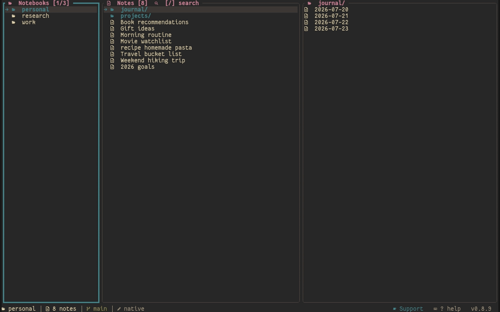
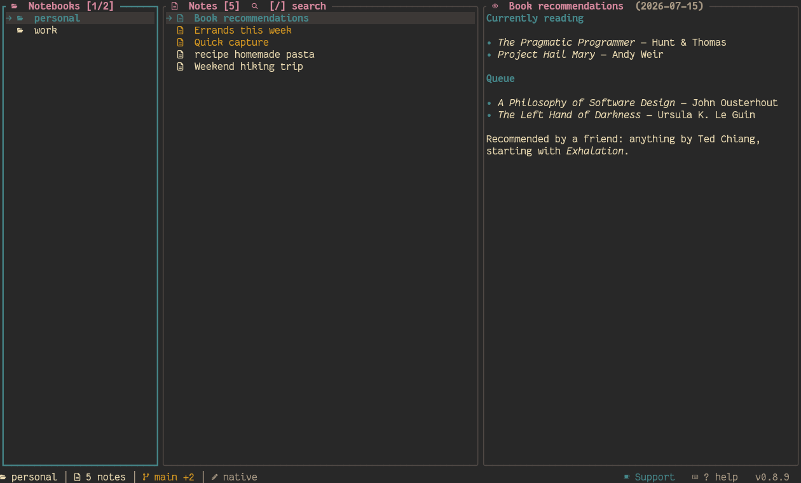
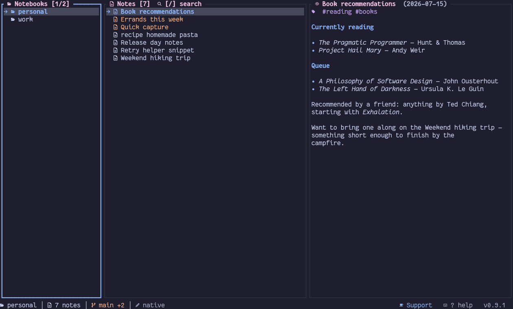

<p align="center">
  
</p>

# shiki (私記)

> **Personal notes, private log.**
> A TUI note-taking app in Rust — three-pane Yazi-style navigation, notebooks as
> independent git repos, Markdown with frontmatter, inline and external editing,
> real per-note version history, themes, and fast fuzzy search.

[](LICENSE)
[](https://github.com/sazardev/shiki/stargazers)
[](https://github.com/sazardev/shiki/commits/main)
[](https://github.com/sazardev/shiki)


See [IDEA.md](IDEA.md) for the full design spec (keybinding tables, config schema, theme list) and
[CHANGELOG.md](CHANGELOG.md) for release history.

## Demo

<p align="center">
  
</p>

Three notebooks, ~30 notes, folders nested two levels deep — a scripted, reproducible tour
([`scripts/demo-gif.sh`](scripts/demo-gif.sh), recorded with [VHS](https://github.com/charmbracelet/vhs))
covering global and in-notebook fuzzy search, tags, real multi-select (batch delete), creating and
moving folders, writing a full note from scratch in the inline editor, a git commit, and live theme
switching. Regenerated automatically after every release (same `update-screenshots` job in
[`release.yml`](.github/workflows/release.yml) that refreshes the screenshots below), so it's
always recorded against that release's own binary — not a workflow from several versions ago.

## Screenshots

<table>
  <tr>
    <td></td>
    <td></td>
  </tr>
  <tr>
    <td align="center"><sub>Gruvbox Dark</sub></td>
    <td align="center"><sub>Catppuccin Mocha</sub></td>
  </tr>
  <tr>
    <td></td>
    <td></td>
  </tr>
  <tr>
    <td align="center"><sub>Cyberpunk 2077</sub></td>
    <td align="center"><sub>LoL (Jinx)</sub></td>
  </tr>
</table>

These update automatically after every release (`update-screenshots` job in
[`release.yml`](.github/workflows/release.yml)), so they always reflect the current version — not
a screenshot from three releases ago. All 37 built-in themes have a live, interactive preview on
the [website](https://sazardev.github.io/shiki/#themes).

## Features

- **Three-pane TUI**, Yazi-inspired: modal navigation (`hjkl`/arrows), collapsing Miller-columns
  layout, and fully **responsive to terminal size** — wide terminals get the 3-column layout,
  narrow/square ones stack panels vertically, very small ones show just the focused panel,
  full screen.
- **Notebooks are independent git repos** — plain directories under the hood, each its own repo,
  with folders nested to any depth (`nb`-style). Frontmatter is optional on read, so a plain
  Markdown file dropped in from elsewhere still shows up.
- **Bring your own notes directory** — `[general] data_dir` points the whole notebooks root at an
  existing folder (e.g. an Obsidian vault), and `[notebooks.<name>] path` points an individual
  notebook at any directory independent of that, with no migration, symlinks, or duplicated files.
- **Real per-note version history** (not a separate versioning system): every commit that changed
  a specific note, browsable and revertible straight from the TUI.
- **Full git workflow per notebook**: manual sync/push/pull, `auto_sync` (commit + push
  automatically every N changes), per-notebook policy overrides, robust HTTPS/SSH auth that
  reuses your system's own git credential store, and automatic fallback to the remote's actual
  default branch.
- **37 built-in themes** (Catppuccin Mocha, Tokyo Night, Gruvbox ×6, Solarized Dark, Nord,
  Dracula, One Dark, Monokai, League of Legends champions, video-game and hacker/cyberpunk
  palettes, and a
  terminal-native default that inherits your terminal's own palette) with a live-preview picker.
- **Config-driven keybindings**, scoped by focus, fully remappable in `config.toml` — nothing
  hardcoded except plain navigation.
- **Mouse drag-to-select and copy** in PREVIEW — drag over a note's rendered body to highlight and
  copy the selected rows to the clipboard (OSC 52) on release; toggleable via
  `general.mouse_drag_selection`.
- **Global fuzzy search** across every notebook, plus in-notebook fuzzy jump.
- **Notebook tree view**, tags panel, daily notes with templates, moving notes between notebooks,
  cycling sort order, an optional date column in the notes list.
- **Inline editor** built into the TUI, or your favorite external editor — auto-detected from
  `$VISUAL`/`$EDITOR`/the OS default, toggleable on the fly from the footer. Long lines wrap to the
  panel width instead of scrolling off-screen, and a `/`-menu (type `/` at the start of a line)
  drops in 19 ready-made blocks — headers, code, math, tables, checklists, links, images,
  callouts, a collapsible section, a YAML frontmatter skeleton, and more — fully
  customizable/overridable via `[snippets.<trigger>]` in `config.toml`.
- **Editor conveniences, all independently toggleable**: `Ctrl+D` stamps the date (and time),
  `Ctrl+F` find/replace, `Ctrl+B`/`Ctrl+Alt+I` bold/italic wrapping, bracket auto-pairing,
  list auto-continuation, move/duplicate line, multi-cursor, and a `Ctrl+E` spell-check pass that
  underlines misspellings and offers hunspell suggestions in a popup.
- **PREVIEW renders images, diagrams, and math, not just markdown**: a `` image on its
  own line becomes real terminal art via `chafa`, ` ```mermaid ` fences become diagrams,
  `$$...$$` math is prettified to readable Unicode, code fences get per-token highlighting with a
  line-number gutter, and `<details>` blocks fold on click. The outline modal (`o`/`Ctrl+O`) jumps
  to any heading with a live filter.
- **12 built-in note templates** (`default`/`daily`/`meeting` plus `bug`/`spec`/`review`/
  `postmortem`/`standup`/`retro`/`1on1`/`weekly`/`brainstorm`) — pick one from the template picker
  when creating a note, or type `@` in the title prompt for a fast dropdown (`today`/`yesterday`/
  `tomorrow` or any template, fuzzy-filtered) that skips straight to editing.
- **Settings screen** (leader+`s`) — every config option editable in place, paged by tab
  (GENERAL/THEME/GIT/EDITOR/EXPORT/NOTEBOOKS/SNIPPETS): true/false fields toggle and save
  immediately, anything else opens a prompt prefilled with its current value; `i`/`E` still jump
  straight to editing `config.toml` itself for anything not covered. Saved changes apply
  immediately, no restart needed.
- **Logs modal** recording every status message (so errors don't get lost), with one-key clipboard
  copy (OSC 52) for pasting elsewhere.
- **In-TUI self-update** (leader+`U`) — checks GitHub Releases for a newer version, and on
  confirmation downloads, verifies, installs, and relaunches into it automatically.
- **`shiki doctor`** — an environment health check that works even with a broken config; also
  flags duplicate/colliding keybindings, `/`-menu snippet triggers, unrecognized `config.toml` keys,
  and colliding notebook paths before they cause confusion.
- **CLI commands** alongside the TUI (`new`, `capture`, `list`, `edit`, `show`, `search`,
  `daily`, `sync`, `export`, `publish`, `tasks`, `graph`, `query`, `notebook`, `theme`, `import`,
  `config`, `doctor`) for quick one-off operations without opening the UI.
- **One-command migration**: `shiki import obsidian <vault>` adopts an existing Obsidian vault as
  a notebook in place (`--copy` to duplicate, `--tags` to merge inline #hashtags into frontmatter),
  and `shiki import notion <export.zip>` converts a Notion export — UUID-stripped names, internal
  links become `[[wikilinks]]`. Renaming notes updates every inbound `[[wikilink]]` (behind a
  confirm), Obsidian's `aliases:` and `[[note#heading]]` syntax resolve natively, `![[embed]]`
  images render in PREVIEW, and pasting a screenshot with `Ctrl+V` saves it into the notebook's
  `attachments/` and inserts the link.

## Install

Every tagged release (`.github/workflows/release.yml`) publishes prebuilt binaries for Linux,
Windows, and macOS (Intel + Apple Silicon) as a GitHub Release, plus a `SHA256SUMS.txt`. Pick
whichever of these fits your platform:

**Arch Linux (`yay`/`paru`):**

```sh
yay -S shiki-bin      # or: paru -S shiki-bin      — prebuilt binary, fastest
yay -S shiki          # or: paru -S shiki           — builds from source (needs cargo)
```

**Windows ([Scoop](https://scoop.sh)):**

```powershell
scoop bucket add sazardev https://github.com/sazardev/shiki
scoop install shiki
```

(or, without adding a bucket — a one-off install that `scoop update` won't track:
`scoop install https://raw.githubusercontent.com/sazardev/shiki/main/packaging/scoop/shiki.json`)

> **Troubleshooting:** `scoop install shiki` failing with `Couldn't find manifest for 'shiki'`
> means the `sazardev` bucket isn't added yet (run the `scoop bucket add` line above first) —
> or, if you'd added it a while ago, Scoop's local copy of it is stale; run `scoop update` first,
> then `scoop install shiki` again.

**macOS ([Homebrew](https://brew.sh)):**

```sh
brew install sazardev/shiki/shiki
```

> **Note:** use the fully-qualified `owner/tap/formula` form above, not `brew tap sazardev/shiki`
> followed by `brew install shiki` — homebrew/core has its own unrelated `shiki` formula (a syntax
> highlighter), and a plain `brew install shiki` after tapping resolves to that one instead of this
> project's formula.

**Prebuilt binary (Linux/Windows/macOS), no package manager:**

Download the archive for your platform from the
[latest release](https://github.com/sazardev/shiki/releases/latest), extract it, and put the
`shiki`/`shiki.exe` binary on your `$PATH`.

**With `cargo`, from [crates.io](https://crates.io/crates/shiki-cli) (any platform with a Rust
toolchain):**

```sh
cargo install shiki-cli
```

Or straight from a clone, if you want to build from a specific branch/commit instead:

```sh
git clone https://github.com/sazardev/shiki
cd shiki
cargo install --path shiki-cli
```

Either way this builds the `shiki` binary in release mode and installs it to `~/.cargo/bin` (make
sure that's on your `$PATH` — `cargo install` will tell you if it isn't). libgit2/OpenSSL are
vendored and built from source (`git2`'s `vendored-libgit2`/`vendored-openssl` features), so
there's no system libgit2/OpenSSL dependency to install separately on any platform.

**Prerequisites (source/cargo install only — prebuilt binaries/AUR/Scoop/Homebrew don't need a
Rust toolchain):**
- A recent stable Rust toolchain (`rustup`).
- `git` on `$PATH` — notebooks are git repos under the hood.
- A [Nerd Font](https://www.nerdfonts.com) in your terminal — the UI uses Nerd Font icons
  throughout; without one, icons render as boxes/blanks instead of glyphs.
- Optional: [`gh`](https://cli.github.com) (GitHub CLI) — if you use HTTPS remotes to private
  GitHub repos, having `gh` authenticated lets shiki's git credential lookup reuse it automatically.

Run `shiki doctor` after installing (see below) to check all of this in one shot.

## Update

The easiest way, regardless of how you installed: inside the TUI, press leader+`U`. It checks
GitHub Releases in the background, shows "update available" if there's a newer version, and on
confirmation downloads, verifies, installs, and relaunches into it automatically — no terminal
needed.

From the command line instead:

```sh
cargo install shiki-cli   # from crates.io — auto-upgrades if a newer version is published
```

```sh
cd shiki                              # from a source clone
git pull
cargo install --path shiki-cli --force
```

If you installed via `yay`/`paru`, Scoop, or Homebrew, prefer their own update command
(`yay -Syu`/`scoop update shiki`/`brew upgrade shiki`) instead of leader+`U` — the package manager
owns that file and needs to stay in sync with what's actually on disk. AUR installs in particular
install to `/usr/bin`, which leader+`U` can't write to without root anyway, so it fails with a
permission error there rather than silently doing something surprising.

## Verify

```sh
shiki --version   # confirm the installed version
shiki doctor      # environment check: config, data dir, git, editor, terminal, notebooks
```

`shiki doctor` is safe to run any time, including right after install with no config yet —
it reports what's missing rather than erroring out, and works even if a config file exists but
is malformed (a normal `shiki` command would fail outright in that case; `doctor` diagnoses it).

## Quick start

```sh
shiki                       # launches the TUI — no args
shiki notebook create work  # or from the TUI: `a` while NOTEBOOKS is focused
shiki new "My first note" --notebook work
shiki daily                 # today's daily note
```

Inside the TUI, press `?` for a searchable list of every keybinding (also doubles as a command
palette — type to filter, `Enter` runs the highlighted action). Full keybinding tables, config
schema, and theme list are in [IDEA.md](IDEA.md).

## Development

See [CLAUDE.md](CLAUDE.md) for the crate layout, build/lint commands, and architecture notes.

## Contributing

Contributions are welcome — see [CONTRIBUTING.md](CONTRIBUTING.md) for the development setup,
coding conventions, and pull request checklist. This project follows a
[Code of Conduct](CODE_OF_CONDUCT.md); please report security issues privately per
[SECURITY.md](SECURITY.md) rather than opening a public issue.

## License

[MIT](LICENSE) — free to use, modify, and redistribute.
